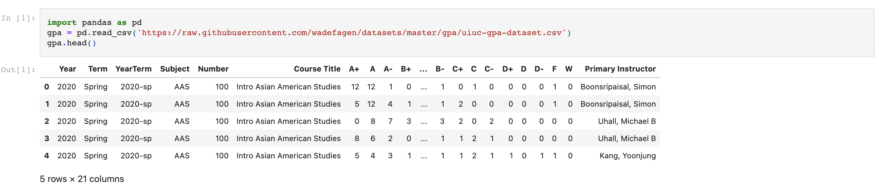
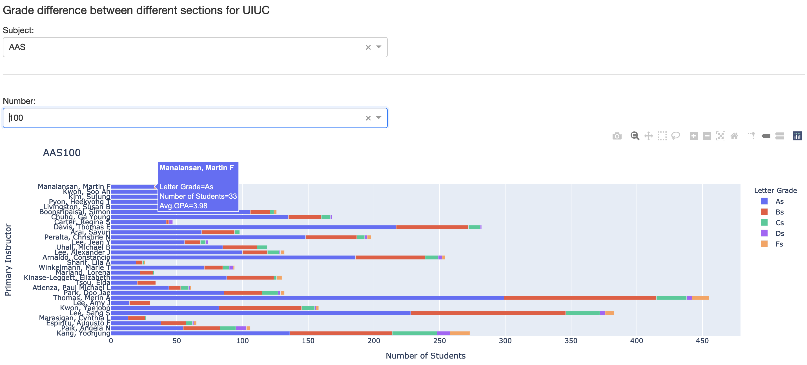

# Grade Difference between Different Sections

## Section 1: Dataset Description

This Project focuses on [University of Illinois’ GPA Dataset ](https://github.com/wadefagen/datasets/blob/master/gpa/uiuc-gpa-dataset.csv) and it records the grade distribution of 163 subjects in UIUC from 2010 to 2020. In total, there are 53933 records and 155 of them have missing values. Records with missing values are removed considering the relatively small percentage. From the preview of the dataset below, we can see that there are 21 columns and the columns that we will be focusing on are **Subject**, **Number**, **Primary Instructor** and columns with letter grade.

## Section 2: Question of Interest

The goal of the web app is to illustrate the grade difference between different sections. Given a subject and corresponding course number, the web app would generate a bar chart demonstrating the grade distribution and average GPA of different instructors teaching the same course. Also, the bar chart is sorted so that sections with higher average GPA appear upper in the graph.

## Section 3: Testing of the Web App

To generate the bar chart, one would first select a subject from the **Subject** dropdown box and a course number from the **Number** dropdown box. To test the web app, I tried AAS100, CS100 and YDSH220. For each case, I filtered the dataset based on the chosen subject and course number first. Then, I added the number of different letter grades for each instructor and check if they are the same as the ones shown on the web app. An example is provided below where AAS100 is selected. The hover data contains grade distribution and average GPA. From the graph, it is clear that section taught by Manalansan, Martin F has the highest average GPA of 3.98 and most of the students get As for this section.

## Section 4: Conclusion & Discussion

In conclusion, this project demonstrates the grade difference between different sections in UIUC. It provides good recommendation to students who need to decide between different sections. From my observations, sections with larger number of students tend to have lower average GPA. It may provide bias to the results and we may consider adding weights to those large sections for fair comparison in the future.